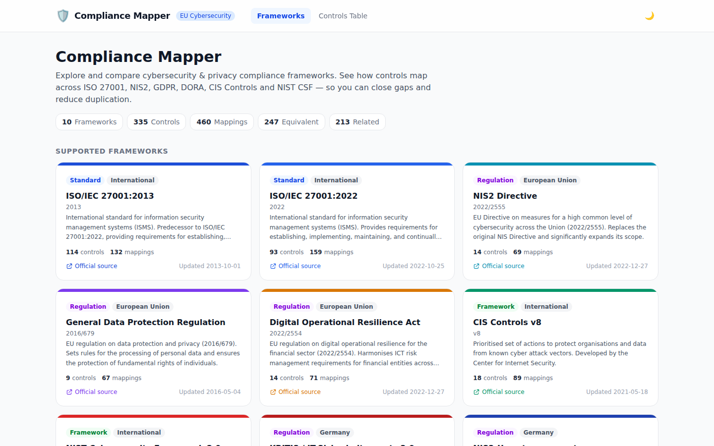

<div align="center">

# 🛡️ Compliance Mapper

**Map overlapping controls across cybersecurity and privacy frameworks — so you can close gaps and reduce duplication.**

[](https://github.com/veniplex/compliance-mapper/releases)
[](https://kit.svelte.dev/)
[](https://tailwindcss.com/)
[](https://nodejs.org/)
[](LICENSE)
[](https://github.com/veniplex/compliance-mapper/issues)
[](https://github.com/veniplex/compliance-mapper/stargazers)

</div>

> [!IMPORTANT]
> This tool is currently in beta and may have inconsistencies, missing and/or incorrect data.

<div align="center">



</div>

---

## 📋 Table of Contents

- [✨ Features](#-features)
- [🚀 Tech Stack](#-tech-stack)
- [🏁 Getting Started](#-getting-started)
  - [Option A — Docker (recommended)](#option-a--docker-recommended)
  - [Option B — Local Development](#option-b--local-development-no-docker)
- [🗂️ Project Structure](#️-project-structure)
- [🔌 API Reference](#-api-reference)
- [🧪 Running Tests](#-running-tests)
- [📄 License](#-license)

---

## ✨ Features

- 🗺️ **Framework Browser** — explore all supported frameworks and their individual controls
- 🔗 **Cross-Framework Mapping** — query how controls from different frameworks relate to each other
- 🔍 **Relationship Filtering** — filter by `equivalent`, `subset`, `superset`, or `related`
- 👤 **User Accounts** — sign up / sign in with per-control progress tracking
- 🌙 **Dark Mode** — full dark mode UI built with Tailwind CSS v4
- 📖 **Live API Docs** — built-in documentation page with a "try it" runner
- 📊 **Progress Dashboard** — per-framework progress bars and an overall compliance score

---

## 🚀 Tech Stack

| Layer | Technology |
|-------|-----------|
| **Frontend** | [SvelteKit](https://kit.svelte.dev/) v2 (Svelte 5 with runes) |
| **Styling** | [Tailwind CSS](https://tailwindcss.com/) v4 |
| **Backend** | SvelteKit server routes via [`@sveltejs/adapter-node`](https://github.com/sveltejs/kit/tree/main/packages/adapter-node) |
| **Runtime** | Node.js ≥ 18 |
| **Data** | JSON files for frameworks, controls, and mappings |
| **Database** | PostgreSQL (user accounts & progress tracking) |

---

## 🏁 Getting Started

### Option A — Docker (recommended)

The easiest way to run the full stack (app + database) is with Docker Compose.

**Prerequisites:** [Docker Desktop](https://www.docker.com/products/docker-desktop/) or Docker Engine + Compose plugin.

1. **Copy the example environment file and set your secrets:**

   ```bash
   cp .env.example .env
   ```

   `DB_PASSWORD` and `JWT_SECRET` **must** be set — Docker Compose will refuse to start without them:

   ```env
   DB_PASSWORD=a-strong-db-password
   JWT_SECRET=a-long-random-string-at-least-32-characters
   ```

2. **Start the stack:**

   ```bash
   docker compose up --build
   ```

   On the first run Docker will:
   - Build the app image (runs `npm run build` for the SvelteKit app)
   - Pull the `postgres:16-alpine` image
   - Wait for PostgreSQL to be healthy, then start the app

3. **Open the app:** [http://localhost:3000](http://localhost:3000)

4. **Stop the stack:**

   ```bash
   docker compose down      # keep the database volume
   docker compose down -v   # also remove the database volume
   ```

<details>
<summary>📋 Useful Compose commands</summary>

| Command | Description |
|---------|-------------|
| `docker compose up -d` | Start in the background (detached) |
| `docker compose logs -f app` | Stream app logs |
| `docker compose logs -f db` | Stream database logs |
| `docker compose ps` | Show running services |
| `docker compose exec db psql -U ${DB_USER:-postgres} ${DB_NAME:-compliance_mapper}` | Open a psql shell |

</details>

<details>
<summary>⚙️ Environment variables</summary>

| Variable | Default | Description |
|----------|---------|-------------|
| `PORT` | `3000` | Host port to expose the app on |
| `DB_NAME` | `compliance_mapper` | PostgreSQL database name |
| `DB_USER` | `postgres` | PostgreSQL user |
| `DB_PASSWORD` | _(required)_ | PostgreSQL password |
| `JWT_SECRET` | _(required)_ | Secret for signing JWTs — use a long random string |
| `BCRYPT_ROUNDS` | `12` | bcrypt work factor for password hashing |
| `STANDALONE_MODE` | `false` | Set to `true` to disable database features (serves data-only) |

</details>

---

### Option B — Local Development (no Docker)

You need Node.js ≥ 18 and a running PostgreSQL instance.

1. **Install dependencies:**

   ```bash
   npm install
   ```

2. **Configure environment:**

   ```bash
   cp .env.example .env
   # Edit .env — set DB_HOST, DB_USER, DB_PASSWORD, DB_NAME, JWT_SECRET
   ```

3. **Run in development mode (with HMR):**

   ```bash
   npm run dev
   ```

4. **Build and run for production:**

   ```bash
   npm run build
   npm start
   ```

The app is available at `http://localhost:3000` in production or `http://localhost:5173` in dev mode.

> **Note:** The app starts even without a database — framework and mapping data are served from JSON files. Auth and progress endpoints return `503` until a database is reachable. Set `STANDALONE_MODE=true` to explicitly disable database features.

---

## 🗂️ Project Structure

<details>
<summary>Click to expand</summary>

```
src/
├── lib/
│   ├── components/          # Reusable Svelte components
│   │   ├── NavBar.svelte        # Top navigation bar
│   │   ├── FrameworkCard.svelte # Framework grid card
│   │   ├── FwBadge.svelte       # Coloured framework badge
│   │   ├── RelPill.svelte       # Mapping relationship pill
│   │   ├── ProgressBadge.svelte # Per-control progress indicator
│   │   ├── Modal.svelte         # Reusable modal dialog
│   │   ├── AuthModal.svelte     # Sign in / Sign up modal
│   │   └── DonutChart.svelte    # SVG donut chart for score
│   ├── server/              # Server-only modules
│   │   ├── auth.js              # JWT helpers
│   │   ├── data.js              # Loads JSON data files
│   │   └── db.js                # PostgreSQL pool
│   ├── api.js               # Client-side API fetch helpers
│   ├── stores.js            # Svelte stores (auth, frameworks, progress)
│   └── utils.js             # Shared utilities (progress cycle, preferences)
├── routes/
│   ├── +layout.svelte       # Root layout (NavBar, data init)
│   ├── +page.svelte         # Frameworks grid (home page)
│   ├── frameworks/[id]/     # Framework detail + controls list
│   ├── controls/            # Cross-framework mapping table
│   ├── api-docs/            # Interactive REST API docs
│   ├── dashboard/           # Progress dashboard
│   ├── settings/            # Account settings (profile, password, API keys)
│   └── api/                 # SvelteKit server routes (REST API)
│       ├── frameworks/
│       ├── controls/
│       ├── mappings/
│       ├── auth/            # register, login, me
│       ├── progress/
│       ├── settings/
│       ├── stats/
│       ├── themes/
│       └── config/
└── hooks.server.js          # CORS headers + JSON error format for API routes
```

</details>

---

## 🔌 API Reference

### 📂 Public endpoints (framework & mapping data)

| Method | Path | Description |
|--------|------|-------------|
| `GET` | `/api/frameworks` | List all frameworks |
| `GET` | `/api/frameworks/:id` | Get a single framework |
| `GET` | `/api/frameworks/:id/controls` | List controls for a framework |
| `GET` | `/api/controls` | List controls (optional `?framework=` filter) |
| `GET` | `/api/controls/:id` | Get a single control |
| `GET` | `/api/mappings` | Query mappings (`?from=`, `?to=`, `?control=`, `?relationship=`) |
| `GET` | `/api/mappings/:id` | Get a single mapping |
| `GET` | `/api/themes` | List unique themes across all controls |
| `GET` | `/api/stats` | Get summary statistics |
| `GET` | `/api/config` | Returns `{ dbEnabled: boolean }` |

### 🔐 Authentication

| Method | Path | Description |
|--------|------|-------------|
| `POST` | `/api/auth/register` | Create a new account (`{ email, password }`) |
| `POST` | `/api/auth/login` | Sign in (`{ email, password }`) → returns JWT |
| `GET` | `/api/auth/me` | Validate token and return current user |

### 📈 Progress tracking _(requires `Authorization: Bearer <token>`)_

| Method | Path | Description |
|--------|------|-------------|
| `GET` | `/api/progress` | List progress for all controls (`?framework=` filter) |
| `PUT` | `/api/progress/:controlId` | Set status for a control (`{ status, notes? }`) |
| `DELETE` | `/api/progress/:controlId` | Remove progress entry for a control |

Progress `status` values: `not_started` · `in_progress` · `completed`

### ⚙️ Settings _(requires `Authorization: Bearer <token>`)_

| Method | Path | Description |
|--------|------|-------------|
| `GET` | `/api/settings/profile` | Get profile |
| `PATCH` | `/api/settings/profile` | Update profile (`{ username?, email? }`) |
| `PATCH` | `/api/settings/password` | Change password (`{ currentPassword, newPassword }`) |
| `GET` | `/api/settings/apikeys` | List API keys |
| `POST` | `/api/settings/apikeys` | Create API key (`{ name? }`) |
| `DELETE` | `/api/settings/apikeys/:id` | Revoke API key |

---

## 🧪 Running Tests

```bash
npm test
```

Tests cover all public API endpoints using the built SvelteKit server (runs `npm run build` first). The test runner is Node.js built-in `node:test`.

---

## 📄 License

This project is released under a custom **Non-Commercial Use License**. See the [LICENSE](LICENSE) file for the full terms.

| | |
|---|---|
| ✅ **Permitted** | Personal use, educational & research use, open-source projects, internal business use |
| ❌ **Prohibited** | Selling this software or derivatives, delivering paid services to clients, bundling in commercial products |

For commercial licensing enquiries, open an issue or contact the maintainer via the repository.

---

<p align="center">Made with ❤️ by <a href="https://github.com/veniplex">@veniplex</a></p>
